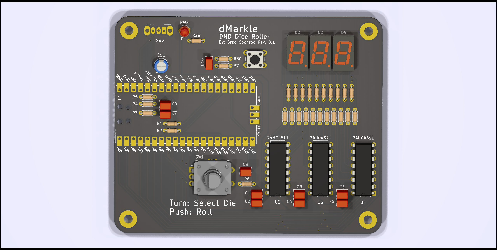

<!--
 dMarkle (c) by Greg Coonrod
 
 dMarkle is licensed under a
 Creative Commons Attribution-ShareAlike 4.0 International License.
 
 You should have received a copy of the license along with this
 work. If not, see <http://creativecommons.org/licenses/by-sa/4.0/>.
-->

# dMarkle

A Raspberry Pi Pico based dice rolling toy.

## Usage

The dMarkle is programmed to roll one of any d4, d6, d8, d10, d12, d20, or d100 dice. The rotary encoder can be turned to select the die and then pushed to roll.

## Schematic and PCB

- Current [Schematic](./dMarkle-schematic-rev0.1.pdf)
- Current [PCB](./dMarkle-board-rev0.1.pdf)
  - The Pi Pico will be mounted on pin sockets. Hence the components that would otherwise be in an exclusion zone.
